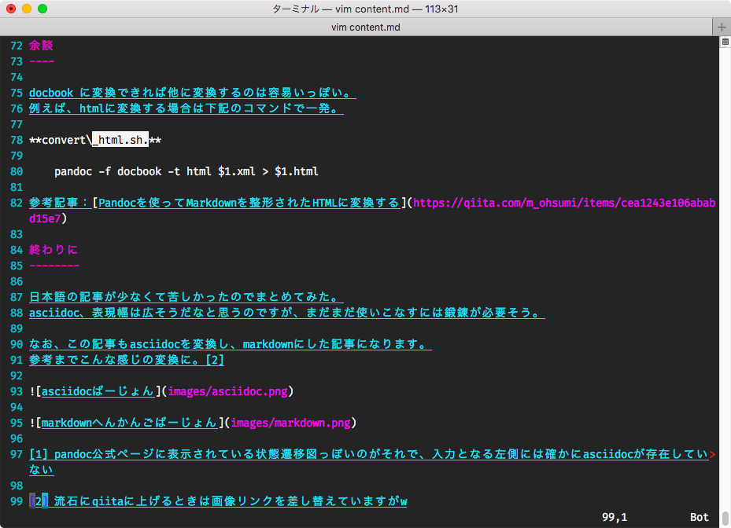

asciidoc to markdown
====================

ググったけど結局いい感じのものが見つからなかったので、自分用のメモを兼ねて。
asciidocをmarkdownに変換しようとしてハマった話です。Linuxは参考にした記事を、Macはこの記事を参考にすることで解決の糸口になるかもしれませんが、Windowsは検証する環境が現在無いため、わかりません。。。あしからず。

TL;DR
-----

-   ココ見て[Convert asciidoc to
    markdown](https://tinyapps.org/blog/nix/201701240700_convert_asciidoc_to_markdown.html)

-   `pandoc`, `asciidoc` をインストールする

-   asciidocのコマンドでdocbookに変換したら、docbookをpandocでmarkdownに変換する

背景
----

少し周りで[asciidoc](http://asciidoc.org/)の話を聞いてみたので実際に試してみようと思い、ブログ記事をかき始めた。
ブログサービスではmarkdownをサポートしているため、変換する必要があった。

そこで[Pandoc](https://pandoc.org/)でサクッと変換してブログ記事の記載を完了…
する予定だったのだが、pandocではインプットするソースファイルにasciidocの形式のファイルが取れないことがわかった。[1]

そこで変換する方法を調べた…。

参考にした記事
--------------

-   [Convert asciidoc to markdown -
    tinyapps.org](https://tinyapps.org/blog/nix/201701240700_convert_asciidoc_to_markdown.html)

    -   最終的にココを見て解決しました

-   [Convert asciidoc to markdown -
    stackoverflow](https://stackoverflow.com/questions/26430433/convert-asciidoc-to-markdown)

    -   最初の方に見ていたページ。まさかこんなめんどくさいとは思わなかった…。

手順
----

上記、参考記事の手順2までとほぼ同様の操作になる。

`pandoc` と `asciidoc` をインストールする; Macの場合(brewを使う)  
`brew install pandoc asciidoc`

Linuxの場合  
`sudo apt install pandoc asciidoc`

asciidocでpandoc形式に変換する(ココで生成されるarticle.xmlがdocbook)  
`asciidoc -b docbook article.adoc`

pandocでmarkdown形式に変換する  
`pandoc -f docbook -t markdown_strict article.xml -o article.md`

大変すぎる！

shellにしとく
-------------

**convert.sh.**

    #!/bin/sh
    asciidoc -b docbook $1.adoc
    pandoc -f docbook -t markdown_strict $1.xml -o $1.md
    pandoc -f docbook -t html $1.xml > $1.html # 後述するHTML出力

これで `./convert.sh article` とかで叩けば良いのでは、と思いました。

余談
----

docbook に変換できれば他に変換するのは容易いっぽい。
例えば、htmlに変換する場合は下記のコマンドで一発。

**convert\_html.sh.**

    pandoc -f docbook -t html $1.xml > $1.html

参考記事：[Pandocを使ってMarkdownを整形されたHTMLに変換する](https://qiita.com/m_ohsumi/items/cea1243e106ababd15e7)

終わりに
--------

日本語の記事が少なくて苦しかったのでまとめてみた。
asciidoc、表現幅は広そうだなと思うのですが、まだまだ使いこなすには鍛錬が必要そう。

なお、この記事もasciidocを変換し、markdownにした記事になります。
参考までこんな感じの変換に。[2]

[1] pandoc公式ページに表示されている状態遷移図っぽいのがそれで、入力となる左側には確かにasciidocが存在していない

[2] 流石にqiitaに上げるときは画像リンクを差し替えていますがw
